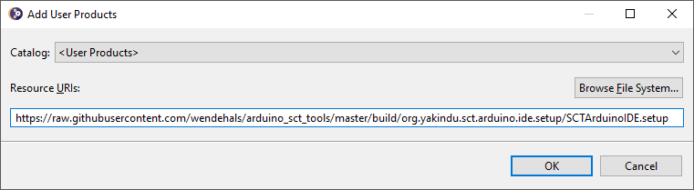
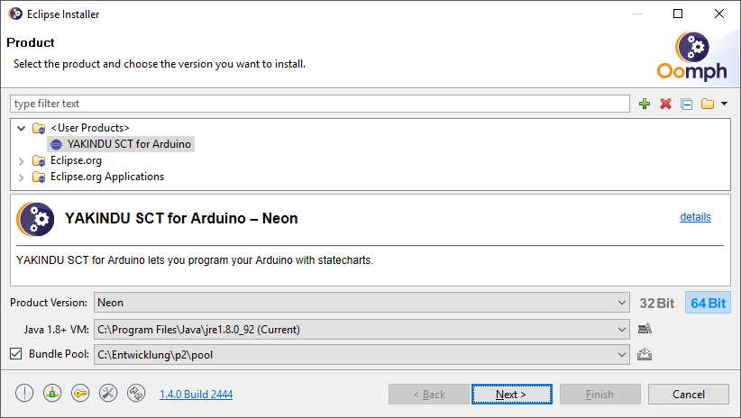
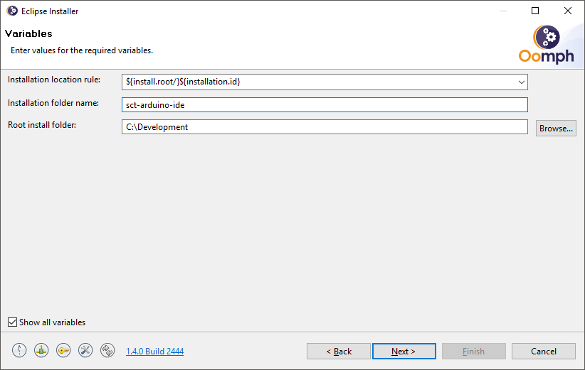

# Installation

First you need to download the [Eclipse Installer](https://www.eclipse.org/downloads/). Start it and switch to the advanced mode.

In the advanced mode click the "+" button in the upper right corner to add a user product. Copy and paste the URL of the YAKINDU SCT for Arduino IDE setup to the dialog:
https://raw.githubusercontent.com/wendehals/arduino_sct_tools/master/build/org.yakindu.sct.arduino.ide.setup/SCTArduinoIDE.setup

Select YAKINDU SCT for Arduino and press the "Next>" button to switch to the next page.  

Just click "Next>" on the Projects page. On the Variables page choose an Installation folder name and the Root install folder and press "Next>". Just confirm the last page by clicking "Finish" on the last page. 

The installation will start immediately. The installed IDE will start automatically, you just need to enter and confirm the workspace path.
