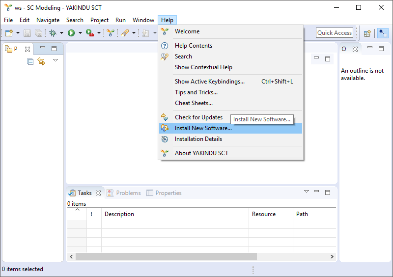
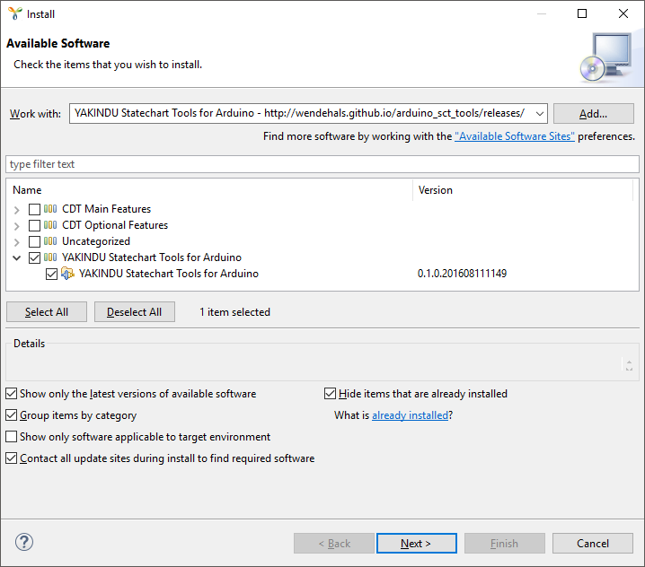

# Installation

First you need to download the [YAKINDU Statechart Tools](http://www.statecharts.org/). Unzip the archive to an arbitrary directory and start SCT. Choose "Install New Software..." from the "Help" menu.

Select the "Add..." button in the upper right corner to add a new update site. Copy the following URL to the "Location" text field: [https://wendehals.github.io/arduino\_sct\_tools/releases/](https://wendehals.github.io/arduino_sct_tools/releases/). Use any value for the "Name" field and select "OK".

Select YAKINDU Statechart Tools for Arduino and press the "Next>" button to switch to the next page.  

 

